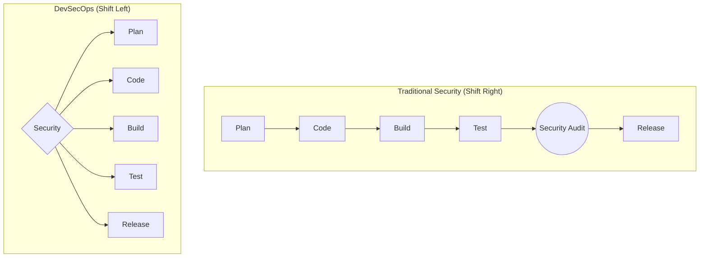

# Module 1, Week 1: The "Why" - DevOps, DevSecOps & Modern SDLC

Welcome to the first week of your journey to becoming an Automated Cloud Architect. Before we touch a single line of code, we must understand the cultural and procedural shifts that make modern cloud infrastructure possible. This week, we focus on the "why" behind our actions.

---

## Session 1: What is DevOps? (It's Not a Job Title)

At its core, **DevOps is a culture of ownership, collaboration, and communication.** It is the practice of breaking down the traditional silos between Development (Dev) teams, who write the code, and Operations (Ops) teams, who deploy and maintain it.

| Traditional Model (Silos) | DevOps Model (Collaboration) |
| :--- | :--- |
| Dev "throws code over the wall" to Ops. | Dev and Ops share responsibility for the entire lifecycle. |
| Conflicting goals: Dev wants change, Ops wants stability. | Shared goal: Deliver value to users safely and quickly. |
| Manual handoffs, long release cycles, blame games. | Automated processes, rapid feedback loops, shared learning. |

**The Three Ways of DevOps:**

1.  **The First Way (Systems Thinking):** Focus on the performance of the entire system, not just one part. Never pass a known defect downstream. Strive for a smooth, predictable flow of work from left (Dev) to right (Ops).
2.  **The Second Way (Amplify Feedback Loops):** Create fast, constant feedback loops from right to left. This means developers get immediate information about how their code behaves in production (through monitoring, logs, alerts) so they can fix issues quickly.
3.  **The Third Way (Culture of Continual Experimentation and Learning):** Create a culture where it is safe to experiment, take risks, and learn from failure. Repetition and practice are keys to mastery.

---

## Session 2: What is DevSecOps? (Shifting Security Left)

**DevSecOps** is the natural evolution of DevOps. It integrates security practices into every stage of the DevOps pipeline. Instead of security being a final, separate gate before release, it becomes a shared responsibility of everyone on the team.

The core principle is **"Shifting Left."** This means moving security checks and practices as early into the development lifecycle as possible.

*   **Why Shift Left?** It is exponentially cheaper and faster to fix a security flaw found during development than one discovered in production.
*   **Examples:**
    *   Scanning code for secrets *before* it's committed.
    *   Analyzing dependencies for known vulnerabilities during the build phase.
    *   Automated security testing as part of the CI pipeline.

---

## Session 3: The Modern Software Development Lifecycle (SDLC)

The concepts of DevOps and DevSecOps have fundamentally changed the SDLC.

| Traditional Waterfall SDLC | Modern Agile/DevOps SDLC |
| :--- | :--- |
| **Linear & Sequential:** Rigid phases (Requirements -> Design -> Build -> Test -> Deploy). | **Iterative & Continuous:** Small, frequent cycles of development and release. |
| **Big Bang Releases:** Months or years between major versions. | **Incremental Releases:** Changes are deployed daily or even hourly. |
| **High Risk:** A failure in one phase jeopardizes the entire project. | **Low Risk:** Small changes are easier to test, deploy, and roll back if needed. |
| **Slow Feedback:** Customer feedback is only gathered at the very end. | **Fast Feedback:** Constant feedback from users and system monitoring drives the next cycle. |

The modern SDLC is a continuous loop, often represented as the "infinity loop" of DevOps: **Plan -> Code -> Build -> Test -> Release -> Deploy -> Operate -> Monitor -> (back to Plan)**. Our entire course is dedicated to automating this loop.

---

## Lab 1: Analyze the Workflows

**Objective:** To solidify your understanding of the differences between traditional and modern development workflows.

**Your Task:**

1.  Create a new document (e.g., a simple text file or Markdown file).
2.  In this document, create two sections: "Traditional Workflow" and "Modern DevOps Workflow."
3.  For each section, write a short narrative describing how a simple bug fix would be handled.
    *   **For the Traditional Workflow:** Imagine there are separate Development, QA, and Operations teams. Describe the handoffs, the ticketing systems, the scheduled maintenance windows, and the potential for delay and miscommunication.
    *   **For the Modern DevOps Workflow:** Imagine a single team with shared responsibility. Describe the process: creating a branch, writing an automated test that replicates the bug, fixing the code, watching the automated CI/CD pipeline run, and deploying the fix to production within hours (or minutes).
4.  Save this file locally. It is for your own reference and will help you appreciate the power of the systems we are about to build.
