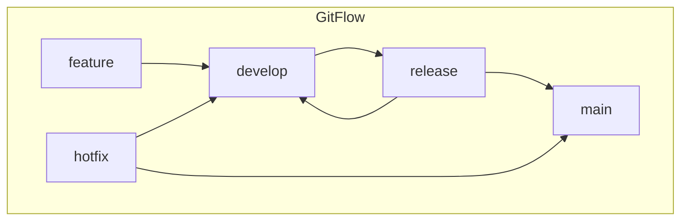

# Module 1, Week 2: The Source of Truth - Git & GitHub Mastery

Welcome to Week 2. In our last session, we discussed the cultural shift of DevOps. Today, we dive into the technology that enables it. Git is the foundation of our automated system; it is the ultimate source of truth for our code, our infrastructure, and our application's state.

---

## Session 1: Git Fundamentals - Thinking in Snapshots

Git is a **distributed version control system**. Unlike older systems that tracked individual file changes, Git thinks in terms of **snapshots** of your entire project at a specific moment in time.

*   **Distributed:** Every developer has a full copy of the entire project history on their local machine. This makes it fast and enables offline work.
*   **Core Concepts:**
    *   **Commit:** A snapshot of your project at a point in time. It has a unique ID (a hash) and a message describing the change.
    *   **Branch:** A lightweight, movable pointer to a specific commit. You create branches to work on new features or fixes in isolation without affecting the main codebase. The default branch is typically named `main` or `master`.
    *   **Merge:** The action of combining the history of one branch into another. For example, merging your completed `feature-x` branch back into `main`.
    *   **Rebase:** An alternative to merging. It moves the entire feature branch to begin on the tip of the `main` branch, creating a cleaner, linear history. It rewrites history, so it should be used with care, especially on shared branches.

---

## Session 2: GitHub - The Central Hub

While Git itself is distributed, a central, shared repository is essential for team collaboration. This is where services like **GitHub** come in.

*   **What GitHub Provides:**
    *   **A "Remote" Repository:** The agreed-upon source of truth for your team.
    *   **Collaboration Tools:** Pull Requests (PRs) are the heart of GitHub collaboration. They are a formal way to propose changes, have them reviewed by peers, and merge them into the main branch.
    *   **Automation Platform:** GitHub Actions (which we will cover in Week 5) allows you to build powerful CI/CD pipelines directly from your repository.
    *   **Access Control & Security:** Manages who can read, write, and merge code.

---

## Session 3: Branching Strategies - The Rules of the Road

A branching strategy is a set of rules for how a team uses Git branches. A consistent strategy is vital for preventing chaos.

### Strategy 1: GitFlow (Complex, for Traditional Releases)

GitFlow uses multiple long-lived branches (`main`, `develop`) and several supporting branches (`feature`, `release`, `hotfix`). It is very structured but can be overly complex for modern, continuous deployment models.



### Strategy 2: Trunk-Based Development (Simple, for DevOps & CI/CD)

This is the preferred model for DevOps and the one we will use. All developers work on short-lived feature branches that originate from and are merged back into a single main branch (the "trunk").

*   **Core Idea:** The `main` branch is *always* stable and deployable.
*   **How it Works:**
    1.  Create a short-lived feature branch from `main`.
    2.  Make small, incremental commits.
    3.  Open a Pull Request to merge back into `main` as soon as possible (ideally within a day).
    4.  Automated tests run on the PR. After review and passing tests, it's merged.
*   **Benefit:** This model forces small, frequent integrations, which reduces merge conflicts and enables a continuous flow of changes, perfectly aligning with DevOps principles.

---

## Lab 2: Setting Up Your Project's Foundation

**Objective:** To get hands-on with Git and GitHub and establish the repository for our course-long project.

**Your Task:**

1.  **Create a GitHub Repository:**
    *   Go to GitHub.com and create a new **public** repository. Name it something like `automated-cloud-architect-course`.
    *   Initialize it with a `README.md` file.

2.  **Clone the Repository:**
    *   On your local machine, run `git clone <your-repository-url>` to create a local copy.

3.  **Implement Trunk-Based Development:**
    *   From the `main` branch, create a new feature branch: `git checkout -b feature/add-hello-world`.
    *   Create a simple `app.py` (Python) or `index.js` (Node.js) file that prints "Hello, World!".
    *   Add, commit, and push this new branch to GitHub:
        ```bash
        git add app.py
        git commit -m "feat: Add initial hello world application"
        git push -u origin feature/add-hello-world
        ```

4.  **Create a Pull Request:**
    *   In the GitHub UI, you will see a prompt to create a Pull Request from your new branch.
    *   Open the PR, give it a title, and then "merge" it.
    *   Delete the feature branch after merging (a common practice).

5.  **Verify Locally:**
    *   On your local machine, switch back to the main branch (`git checkout main`) and pull the latest changes (`git pull`). You should now see the `app.py` or `index.js` file.
